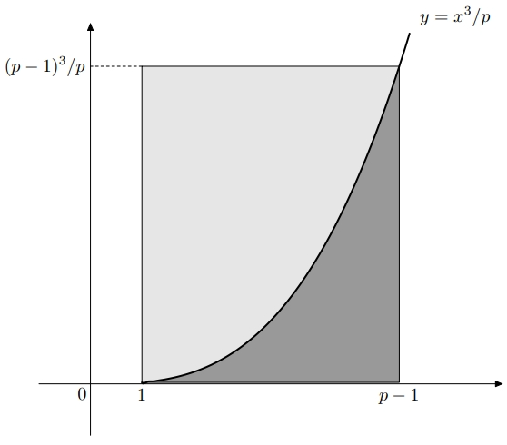

# Seconde série d'exercices d'arithmétique

## Exercices

!!! example "Exercice $26^{*}$ (Iran 96)"

    Soit $k > 0$ un entier. Prouver que tout entier $n > 0$ peut s'écrire de façon unique sous la forme:

    \[n = C^{k}_{a_{k}} + C^{k-1}_{a_{k-1}} + ... + C^{t}_{a_{t}}\]

    où $a_{k} > a_{k-1} > ... > a_{t} \geq t \geq 1$ sont des entiers.

???- success "Solution 26"

    Soient $k > 0$ et $n > 0$ des entiers.

    Pour construire une telle décomposition, on utilise l'algorithme glouton: on commence par déterminer le plus grand entier, disons $a_{k}$ tel que $C_{a_{k}}^{k} \leq n$. Puis, on recommence avec $n$ et $k$ remplacés respectivement par $n - C_{a_{k}}^{k}$ et $k-1$. Comme, par construction, on a $n < C_{a_{k}+1}^{k}$ c'est donc que:

    \[n - C_{a_{k}}^{k} < C_{a_{k}+1}^{k} - C_{a_{k}}^{k} = \frac{a_{k}!\left(a_{k}+1 - (a_{k} + 1 - k)\right)}{(a_{k}+1-k)!k!} \implies n - C_{a_{k}}^{k} < \frac{a_{k}!k}{(a_{k} - (k-1))k!}\]

    Donc:

    \[n - C_{a_{k}}^{k} < \frac{a_{k}!}{(a_{k}-(k-1))!(k-1)!} = C_{a_{k}}^{k-1}\]

    ce qui assure que la suite $(a_{i})$ est bien strictement croissante. En effet, par construction, on aura:

    \[C_{a_{k-1}}^{k-1} \leq n - C_{a_{k}}^{k} < C_{a_{k}}^{k-1} \implies C_{a_{k-1}}^{k-1} < C_{a_{k}}^{k-1} \implies a_{k-1} < a_{k}\]

    On prouve maintenant l'unicité. Supposons que $n$ possède deux représentations distinctes associées respectivement aux suites $a_{k},...,a_{t}$ et $b_{k},...,b_{r}$, pour $t$ et $r$ des entiers naturels. On considère le plus grand indice pour lequel ces deux suites diffèrent. Quitte à éliminer des termes, on peut supposer que cet indice est $k$ et que $a_{k} > b_{k}$. Mais alors:

    \[n = C_{b_{k}}^{k} + C_{b_{k-1}}^{k-1} + ... + C_{b_{r}}^{r} < C_{b_{k}+1}^{k} \leq C_{a_{k}}^{k}\]

    L'inégalité du milieu est due au fait que la suite $(b_{j})_{r \leq j \leq k}$ est strictement croissante que pour tout $j \in \{r,...,k\}$:

    \[C_{b_{j}+1}^{j} - C_{b_{j}}^{j} = C_{b_{j}}^{j-1}\]

    Donc, en supposant que les notations $k-i$, pour $i=1,...,3$ ont un sens, sinon tronque dans les expressions analytiques ci-dessous les termes qui n'ont pas de sens, on a:

    \[C_{b_{k}+1}^{k} - C_{b_{k}}^{k} - C_{b_{k-1}}^{k-1} - C_{b_{k-2}}^{k-2} - ... - C_{b_{r}}^{r} = (C_{b_{k}+1}^{k} - C_{b_{k}}^{k} - C_{b_{k-1}+1}^{k-1}) + (C_{b_{k-1}+1}^{k-1} - C_{b_{k-1}}^{k-1} - C_{b_{k-2}+1}^{k-2}) + (C_{b_{k-2}+1}^{k-2} - C_{b_{k-2}}^{k-2} - C_{b_{k-3}+1}^{k-3}) + ... + (C_{b_{r}+1}^{r} - C_{b_{r}}^{r})\]

    \[C_{b_{k}+1}^{k} - C_{b_{k}}^{k} - C_{b_{k-1}}^{k-1} - C_{b_{k-2}}^{k-2} - ... - C_{b_{r}}^{r} = (C_{b_{k}}^{k-1} - C_{b_{k-1}+1}^{k-1}) + (C_{b_{k-1}}^{k-2} - C_{b_{k-2}+1}^{k-2}) + (C_{b_{k-2}}^{k-3} - C_{b_{k-3}+1}^{k-3}) + ... + (C_{b_{r}+1}^{r} - C_{b_{r}}^{r}) > 0\]

    Car pour $j \in \{r+1, ...,k\}$, $C_{b_{j}}^{j-1} - C_{b_{j-1}+1}^{j-1} \geq 0$, puisque $b_{j} \geq b_{j-1} + 1$ et $C_{b_{r}+1}^{r} - C_{b_{r}}^{r} > 0$. Ainsi:

    \[C_{b_{k}+1}^{k} - C_{b_{k}}^{k} - C_{b_{k-1}}^{k-1} - C_{b_{k-2}}^{k-2} - ... - C_{b_{r}}^{r} > 0 \implies C_{b_{k}+1}^{k} > C_{b_{k}}^{k} + C_{b_{k-1}}^{k-1} + C_{b_{k-2}}^{k-2} + ... + C_{b_{r}}^{r}\]

    La relation

    \[n = C_{b_{k}}^{k} + C_{b_{k-1}}^{k-1} + ... + C_{b_{r}}^{r} < C_{b_{k}+1}^{k} \leq C_{a_{k}}^{k}\]

    est contradiction. Nous avons ainsi prouvé l'unicité. On peut donc conclure que $n$ peut s'écrire de façon unique sous la forme:

    \[n = C^{k}_{a_{k}} + C^{k-1}_{a_{k-1}} + ... + C^{t}_{a_{t}}\]

    où $a_{k} > a_{k-1} > ... > a_{t} \geq t \geq 1$ sont des entiers.

!!! example "Exercice $27^{*}$ (Erdös)"

    Soient $a_{1}, ..., a_{n+1}$ des entiers deux à deux distincts dans $\{1, ..., 2n\}$.

    * __a)__ Montrer qu'il existe $i$ et $j$ tels que $a_{i}$ est premier avec $a_{j}$.
    * __b)__ Montrer qu'il existe $i$ et $j$ distincts tels que $a_{i}$ divise $a_{j}$.

???- success "Solution 27"

    * __a)__ D'après le principe des tiroirs parmi les $a_{i}$, il y en a deux consécutifs, qui sont donc premiers entre eux.
    * __b)__ Écrivons pour tout $i$, $a_{i} = 2^{\alpha_{i}}b_{i}$ pour un certain nombre impair $b_{i}$ forcément compris entre $1$ et $2n$. D'après le principe des tiroirs, puisqu'il y a $n$ nombres impairs entre $1$ et $2n$, il existe $i$ et $j$ tels que $b_{i} = b_{j}$. On peut supposer $\alpha_{i} \leq \alpha_{j}$ et dans ce cas $a_{i}$ divise $a_{j}$.

???- warning "Remarque: Principe des tiroirs"

    Si on cherche à ranger $n+1$ chaussettes dans $n$ tiroirs, on sait qu'au moins un tiroir contient au moins deux chaussettes. Ainsi, si on cherche à ranger $n+1$ objets dans $n$ ensembles, au moins un des ensembles contiendra au moins $2$ objets. Plus généralement, si on cherche à ranger au moins $kn+1$ objets dans $n$ ensembles, on sait qu'au moins un des ensembles contient au moins $k+1$ objets.

!!! example "Exercice $28^{*}$ (Australie 96)"

    Si $n$ est un entier, on note $\sigma(n)$ la somme des diviseurs positifs de $n$. Soit $(n_{i})$ une suite strictement croissante d'entiers telle que $\sigma(n_{i}) - n_{i}$ est constante. Montrer que tous les $n_{i}$ sont premiers.

???- success "Solution 28"

    Si $n$ n'est pas premier, il admet un diviseur $d$ différent de $n$ et supérieur à $\sqrt{n}$. Ainsi, $\sigma(n) - n \geq \sqrt{n}$. La suite $\sigma(n_{i})-n_{i}$ est constante, disons égale à $k$. D'autre part, on prouve par récurrence que $n_{i} \geq i$ pour tout $i$. Considérons un $i > k^{2}$. Si $n_{i}$ n'était pas premier, on aurait:

    \[\sigma(n_{i}) - n_{i} \geq \sqrt{n_{i}} \geq \sqrt{i} > k \]

    ce qui est impossible. Ainsi $n_{i}$ est premier (immédiat d'après la démonstration par l'absurde) et $k=1$ (en effet, sinon, on aura $k = \sigma(n_{k^{4}}) - n_{k^{4}} \geq \sqrt{k^{4}} = k^{2} > k$; ce qui serait absurde). 
    
    Nous avons ainsi démontré que tous les $n_{i}$ sont premiers.

!!! example "Exercice $29^{*}$ (Iran 99)"

    Déterminer tous les entiers $n$ pour lesquels

    \[d_{1}^{2} + d_{2}^{2} + d_{3}^{2} + d_{4}^{2} = n\]

    où $1 = d_{1} < d_{2} < d_{3} < d_{4}$ désignent les quatre plus petits diviseurs de $n$.

???- success "Solution 29"

    Déjà $d_{1} = 1$. Si $n$ était impair, tous ses diviseurs seraient impairs et donc $d_{1}^{2}+d_{2}^{2}+d_{3}^{3}+d_{4}^{2}$ serait pair, or d'après l'énoncé, il est censé être égal à $n$ ce qui n'est pas possible. Donc $n$ est pair et $d_{2}=2$. Si $d_{3}$ et $d_{4}$ étaient de même parité, la somme $d_{1}^{2}+d_{2}^{2}+d_{3}^{2}+d_{4}^{2}$ serait impaire, ce qui n'est pas possible non plus puisque $n$ est pair.

    Supposons que $4$ divise $n$. Les nombres $d_{3}$ et $d_{4}$ sont alors $4$ et un nombre premier $p$ à l'ordre près et on est ramené à l'équation:

    \[21 + p^{2} = n\]

    Or $p$ divise $n$, donc $p$ divise $21$ et ainsi $p$ vaut $3$ ou $7$. On vérifie qu'aucun des deux ne fournit uue solution (car $4$ ne diviserait pas $n$).

    Si $4$ ne divise pas $n$, on a $d_{3}=p$ où $p$ est le plus petit diviseur impair de $n$, et $d_{4} = 2p$ puisque $d_{4}$ doit être pair et le plus petit diviseur de $n$ plus grand que $d_{3}=p$. L'équation devient:

    \[5 + 5p^{2} = n\]

    Donc $p$ divise $5$ puis $p=5$. Cela conduit à $n=130$ qui convient.

!!! example "Exercice $30^{*}$"

    Soient $(a_{n})$ et $(b_{n})$ deux suites d'entiers. On suppose que les suites $(a_{n} + b_{n})$ et $(a_{n}b_{n})$ sont arithmétiques. Montrer qu'il existe une constante $c$ telle que pour tout $n$, on ait $a_{n} = c$ ou $b_{n} = c$.

???- success "Solution 30"

    Écrivons $a_{n} + b_{n} = \alpha + nr$ et $a_{n}b_{n} = \beta + ns$ pour des entiers $\alpha$, $\beta, r$ et $s$. Pour tout $n$, les nombres $a_{n}$ et $b_{n}$ sont les racines du polynôme (d'après la relation racines d'un polynôme et coefficients de ce dernier):

    \[X^{2} - (\alpha + nr)X + (\beta + ns)\]

    Le discriminant $\Delta_{n} = (\alpha + nr)^{2}-4(\beta + ns)$ est donc un carré parfait pour tout entier $n \geq 0$. On a l'égalité:

    \[r^{2}\Delta_{n} = (nr^{2} + \alpha r -2s)^{2} + d\]

    où $d = -4s^{2} + 4rs\alpha - 4\beta r^{2}$ est indépendant de $n$. Si $r \neq 0$, pour $n$ suffisamment grand, on a l'inégalité:

    $$(nr^{2} + \alpha r - 2s - 1)^{2} < r^{2}\Delta_{n} < (nr^{2} + \alpha r -2s + 1)^{2}$$

    Comme $r^{2}\Delta_{n}$ doit être un carré, on doit  forcémet avoir $r^{2}\Delta_{n} = (nr^{2} + \alpha r -2s)^{2}$ et donc $d=0$. Mais alors, notre trinôme admet toujours pour racine $c = \frac{s}{r}$. Comme les suites sont deux suites supposées distinctes (sinon il s'agirait d'une seule suite numérique) et qu'elle ont des rôles symmétriques, l'on peut donc prendre la racine $c=\frac{s}{r}$ comme une valeur d'une suite et donc pour tout $n$, on a $a_{n}=c$ ou $b_{n}=c$.

!!! example "Exercice $31^{*}$ (Corée 98)"

    Trouver tous les entiers strictement positifs $l$, $m$, $n$ premiers entre eux deux à deux tels que:

    \[(l + m + n) \left(\frac{1}{l} + \frac{1}{m} + \frac{1}{n}\right)\]

    soit un entier.

???- success "Solution 31"

    En réduisant au même dénominateur, la condition est équivalente à $lmn$ divise $(l+m+n)(mn + ln + lm)$.
    
    \[(l+m+n)(mn + ln + lm) = l^{2}(m + n) + m^{2}(l + n) + n^{2}(l+m) + 3lmn \]

    \[(l+m+n)(mn + ln + lm) = l(l(m+n) + m^{2} + n^{2} + 3mn) + mn(m+n) \]

    Comme $lmn$ divise $(l+m+n)(mn + ln + lm)$, cette dernière égalité permet de dire $l$ divise $mn(m+n)$ et par le lemme d Gauss $l$ divise $m+n$ (comme $m$, $n$ et $l$ sont premiers entre eux).
    
    De même, avec l'égalité:
    
    \[(l+m+n)(mn + ln + lm) = m(m(l+n) + l^{2} + n^{2} + 3ln) + ln(l+n) \]
    
    $m$ divise $ln(l+n)$ et par le lemme de Gauss, $m$ divise $l+n$. 

    Enfin, avec l'égalité:

    \[(l+m+n)(mn + ln + lm) = n(n(l+m) + l^{2} + m^{2} + 3lm) + lm(l+m) \]

    $n$ divise $lm(l+m)$ et par le lemme de Gauss, $n$ divise $l+m$.

    Les rôles des variables étant symétriques, on peut supposer que $n$ est le plus grand des trois. Du coup, $l+m \leq 2n$ et la condition de divisibilité impose $l+m = n$ ou $l + m = 2n$. Dans ce dernier cas, on a forcément $l = m = n$ et cette valeur commune est $1$ car ils sont premiers entre eux. Le triplet $(1, 1, 1)$ est bien solution.

    Sinon, $l + m  = n$, et en remplaçant, le nombre: 

    \[2(l+m)\left(\frac{1}{l} + \frac{1}{m} + \frac{1}{l+m}\right)\]

    doit être entier, ce qui équivaut à:

    \[2(l+m)\left(\frac{1}{l} + \frac{1}{m}\right) = \frac{2(l+m)^{2}}{lm}\]

    est un entier. Comme $l$ et $m$ sont premiers entre eux, on peut supposer $l$ impair. Alors $l$ divise $(l+m)^{2}$ et donc divise $m^{2}$, ce qui n'est possible que si $l = 1$. Alors $m$ divise $2$, et $m=1$ ou $m=2$ (car $m$ divise $(l+m)^{2}$ impliquerait que $m=1$).

    On en déduit de ce qui précède que les solutions sont les triplets $(1, 1, 1)$, $(1, 1, 2)$, $(1, 2, 3)$ et toutes leurs permutations.

!!! example "Exercice $32^{*}$ (Fonction de Moëbius)"

    On définit la _fonction de Moëbius_ par $\mu(1) = 1$, $\mu(n) = 0$ si $n$ est divisible par $p^{2}$ pour un certain nombre premier $p$, et $\mu(p_{1}...p_{r}) = (-1)^{r}$ si les $p_{i}$ sont des nombres premiers deux à deux distincts.

    * __a)__ Montrer que pour tout $n > 1$, on a:

    \[\sum_{d|n}\mu(d) = 0\]

    * __b)__ En déduire que si $f: \mathbb{N}^{*} \rightarrow \mathbb{N}^{*}$ est une fonction et si $g$ est définie par la formule:

    \[g(n) = \sum_{d|n} f(d)\]

    alors on peut retrouver $f$ à partir de $g$ grâce à la formule:

    \[f(n) = \sum_{d|n} \mu\left(\frac{n}{d}\right)g(d)\]

???- success "Solution 32"

    __a)__ Décomposons $n > 1$ en facteurs premiers:

    \[n = p_{1}^{\alpha_{1}}p_{2}^{\alpha_{2}}...p_{d}^{\alpha_{d}}\]

    Les diviseurs $d$ de $n$ pour lesquels $\mu(d) \neq 0$ s'écrivent $d = \prod_{i\in I}p_{i}$ pour $I$ un certain sous-ensemble de $\{1, ...,d\}$. La valeur de $\mu(d)$ est alors $(-1)^{Card I}$.

    Pour conclure, il faut donc juste voir que l'ensemble $\{1, ..., d\}$ possède autant de sous-ensembles de cardinal pair que de sous-ensembles de cardinal impair. Mais à chaque ensemble de cardinal pair, on peut associer un ensemble cardinal impair en lui ajoutant $1$ s'il n'appartient pas à l'ensemble de départ ou en lui otant s'il appartient. Cette association est bijective: il y a donc autant de sous-ensembles de cardinal pair que de cardinal impair, et la formule de sommation est prouvée.

    __b)__ La somme proposée se réécrit:

    \[\sum_{d|n}\sum_{d'|d}\mu\left(\frac{n}{d}\right)f(d')\]

    Dans la somme précédente, le terme $f(d')$ apparaît pour tout entier $d$ tel que $d'|d|n$. Ainsi le coefficient qui restera au final de $f(d')$ est:

    \[\sum_{d'|d|n}\mu\left(\frac{n}{d}\right)\]

    En écrivant $d = d'x$, cette somme s'écrit encore:

    \[\sum_{x|\frac{n}{d'}} \mu\left(\frac{n}{d'x}\right) = \sum_{x|\frac{n}{d'}} \mu(x)\]

    la dernière égalité provenant du changement de variable $x \mapsto \frac{n}{d'x}$. D'après $a)$, cette somme fait toujours $0$ sauf si $\frac{n}{d'} = 1$ (i.e. $n = d'$) auquel cas elle fait $1$. On trouve ainsi bien la formule annoncée.

!!! example "Exercice $33^{*}$"

    Prouver que parmi dix entiers consécutifs, il y en a un qui est premier avec chacun des autres.

???- success "Solution 33"

    Parmi ces $10$ entiers, il y en a $5$ impairs. Parmi ces $5$ impairs, il y en a au plus $2$ qui sont divisibles par $3$ (noter que les multiples de $3$ sont alternativement pairs et impairs). Parmi ces mêmes $5$, il y en a au plus $1$ qui est multiple de $5$ et plus $1$ qui est multiple de $7$.

    Donc, il y a au moins un des dix entiers qui n'est pas divisible ni par $2$, ni par $3$, ni par $5$, ni par $7$. Appelons-le $n$. Le PGCD de $n$ et $n+k$ est un diviseur de $k$, donc si $k$ est non nul et est compris entre $-9$ et $9$, $PGCD(n, n+k)$ doit être divisible par un nombre premier strictement inférieur à $10$. Mais par construction $n$ n'est divisible par aucun tel nombre premier. L'entier $n$ convient donc.

!!! example "Exercice $34^{*}$ (AMM)"

    Si $n$ est un entier, on note $P(n)$ le produit des diviseurs de $n$. Montrer que si $P(n) = P(m)$ alors $n = m$.

???- success "Solution 34"

    Écrivons:

    \[n = p_{1}^{\alpha_{1}}...p_{d}^{\alpha_{d}}\]

    \[m = p_{1}^{\beta_{1}}...p_{d}^{\beta_{d}}\]

    où les $p_{i}$ sont des nombres premiers deux à deux et les exposants $\alpha_{i}$ et $\beta_{i}$ sont des entiers positifs ou nuls.

    On a vu dans le cours que le produit des diviseurs de $n$ s'écrit:

    \[p_{1}^{\gamma_{1}}...p_{d}^{\gamma_{d}}\]

    pour:

    \[\gamma_{i} = \frac{1}{2}\alpha_{i}(\alpha_{1}+1)...(\alpha_{d} + 1)\]

    L'hypothèse de l'énoncé assure que pour tout $i$:

    \[\alpha_{i}(\alpha_{1}+1)...(\alpha_{d}+1) = \beta_{i}(\beta_{1}+1)...(\beta_{d}+1)\]

    et donc il existe un rationnel $q$, indépendant de $i$, telle que $\alpha_{i} = q\beta_{i}$. Quitte à intervertir $m$ et $n$, on peut supposer $q \geq 1$. L'hypothèse se réécrit alors:

    \[q(q\beta_{1}+1)...(q\beta_{d}+1) = (\beta_{1}+1)...(\beta_{d}+1)\]

    et on voit directement que si $q > 1$, le membre de gauche est strictement supérieur à celui de droite. On a donc $q=1$ et $m=n$.

!!! example "Exercice $35^{*}$"

    Déterminer tous les entiers $n$ et $m$ strictement positifs pour lesquels la somme des entiers de $n$ jusqu'à $n + m$ vaut $1000$.

???- success "Solution 35"

    D'après les formules classiques, la somme des entiers de $n$ jusqu'à $n + m$ vaut

    \[\frac{(2n+m)(m+1)}{2}\]

    et on est donc ramené à l'équation $(2n+m)(m+1) = 2000$. Les nombres $2n+m$ et $m+1$ sont donc des diviseurs associés de $2000$. On remarque en outre d'une part que la somme de ces diviseurs vaut $2n + 2m + 1$ et donc doit être impaire, et d'autre part que $1 < m+1 < 2n+m$.

    La décomposition en facteurs premiers de $2000$ est $2000 = 2^{4}\times 5^{3}$. En vertu de ce qui précède, les seules possibilités sont:

    * $m+1 = 5, 2n+m = 400$, soit $m=4$ et $n=198$
    * $m+1 = 25, 2n+m = 80$, soit $m=24$ et $n=28$
    * $m+1=16, 2n+m = 125$, soit $m=15$ et $n=55$

    qui effectivement conviennent.

    Une autre manière de trouver les valeurs des entiers qui conviennent est d'utiliser un tableau dans lequel, on mettra pour chaque valeur de $m+1$ et $2n+m$, des valeurs dans des colonnes qui précisent si chacune des conditions ci-dessus est vérifiée (à savoir si la somme des diviseurs est impaire et si $1 < m+1 < 2n + m$)

!!! example "Exercice $36^{*}$"

    Déterminer toutes les suites $(a_{n})_{n \geq 1}$ d'entiers strictement positifs telles que $PGCD(a_{i}, a_{j}) = PGCD(i, j)$ pour tous indices $i$ et $j$.

???- success "Solution 36"

    La condition de l'énoncé assure que pour tout n, on a $PGCD(a_{2n}, a_{n}) = PGCD(2n, n) = n$. Ainsi $n$ divise $a_{n}$ et on écrit $a_{n} = nb_{n}$ pour un entier $b_{n} > 0$.

    Supposons par l'absurde qu'il existe $n$ tel que $b_{n} > 1$ et soit $p$ un facteur premier de $b_{n}$. Comme $p$ divise $a_{n}$ et $a_{p}$, il divise $PGCD(a_{n}, a_{p}) = PGCD(n, p)$ et donc $p$ divise $n$. Soit $p^{a}$ la plus grande puissance de $p$ qui divise $n$. Alors $p^{a+1}$ divise $a_{n}$ et puis $PGCD(a_{n}, a_{p^{a+1}}) = PGCD(n,p^{a+1}) = p^{a}$. C'est une contraction, puisque $p^{a+1}$ divise $a_{n}$ et $a_{p^{a+1}}$.

    Finalement, $b_{n} = 1$ pour tout $n$, et donc $a_{n}=n$ pour tout $n$.

    Réciproquement, pour la suite $(a_{n})_{n \geq 1}$ telle que

    \[a_{n} = n, \quad \forall n \geq 1\]

    La condition de l'énoncé est verifiée, c'est-à-dire:

    \[\forall i, j \geq 1, \quad PGCD(a_{i}, a_{j}) = PGCD(i, j)\]

    Ainsi, la solution de l'énoncé est la suite $(a_{n})_{n \geq 1}$ telle que $a_{n} = n$ pour tout $n \in \mathbb{N}$.

!!! example "Exercice $37^{*}$ (Nombres de Mersenne)"

    Montrer que si $2^{n}-1$ est un nombre premier, alors $n$ est également premier.

???- success "Solution 37"

    Supposons que $n$ soit composé et que $d$ soit un diviseur strict de $n$. On peut écrire $n=dd'$ et:

    \[2^{n} - 1 = (2^{d} - 1)(2^{d(d'-1)} + 2^{d(d'-2)} + ... + 1)\]

    Le facteur $2^{d} - 1$ est non trivial (c'est-à-dire différent de $1$ et de $2^{n} - 1$), et donc $2^{n} - 1$ est composé.

    _Commentaire_. Les nombres de la forme $2^{p} - 1$ où $p$ est un nombre premier sont appelés _nombres de Mersenne_. On dispose d'algorithmes spécifiques pour tester leur primalité. C'est pourquoi les plus grands nombres premiers connus à ce jour sont des nombres de Mersenne, le plus grand étant:

    \[2^{136 279 841} - 1\]
    
    découvert le $12$ octobre $2024$.

!!! example "Exercice $38^{*}$ (URSS 61)"

    Prouver que parmi $39$ entiers consécutifs, on peut toujours en trouver un dont la somme des chiffres (écriture décimale) est divisible par $11$.

    Est-ce encore vrai pour $38$ entiers consécutifs ?

???- success "Solution 38"

    Notons $n$ le plus petit multiple de $10$ qui apparait parmi les $39$ entiers consécutifs. Il est immédiat que tous les entiers compris entre $n$ et $n+29$ font partie des $39$ entiers consécutifs.
    
    Notons $s$ la somme des chiffres de $n$. Les entiers $n+1, ..., n+9$ sont parmi les $39$ entiers consécutifs et ont pour somme des chiffres respectivement $s+1, ..., s+9$. 
    
    D'autre part, si on suppose que $n$ ne se termine pas par $90$, l'entier $n+19$ est également parmi les $39$ entiers consécutifs et a pour somme des chiffres $s+10$. Or, parmi les sommes $s, ..., s+10$, il y en a forcément une qui est multiple de $11$; ce qui termine ce cas.

    Si on suppose que $n$ se termine par $90$, alors $n+10$ ne se termine pas par $90$ et on peut appliquer le raisonnement précédent en remplaçant $n$ par $n+10$.

    Ainsi, nous avons montré que parmi $39$ entiers consécutifs, on peut toujours en trouver un dont la somme des chiffres (écriture décimale) est divisible par $11$.

    En analysant la preuve précédente, il est facile de trouver un contre-exemple lorsqu'il est question de $38$ entiers. Par exemple, on peut prendre les entiers compris entre $999 981$ et $1 000 018$. En effet pour ces entiers, la somme des chiffres varie entre $45$ et $54$ puis entre $1$ et $10$, et aucun de ces nombres n'est divisible par $11$.

!!! example "Exercice $39^{**}$ (Putnam 83)"

    Déterminer un nombre réel $x > 0$ tel que, pour tout entier $n > 0$, le nombre $[x^{n}]$ a la même parité que $n$.

???- success "Solution 39"

    Soit $a$ un entier impair et $b$ un entier pair tels que $b < a$. Notons $u$ et $v$ les racines de $x^{2} - ax - b = 0$, avec $v < u$. On vérifie facilement que $u > 1$ et $-1 < v < 0$.

    Pour $n > 0$ entier, on note $S_{n} = u^{n} + v^{n}$. Alors $S_{1} = a, S_{2} = a^{2} + 2b$ et $S_{n+2} = aS_{n+1} + bS_{n}$.

    Puis, par récurrence on a $S_{n}$ impair pour tout $n$. Or $u^{n} = S_{n} - v^{n}$ donc:

    * Si $n$ est impair, on a $S_{n} < u^{n} < S_{n} + 1$ et donc $[u^{n}] = S_{n}$ est impair.
    * Si $n$ est pair, on a $S_{n} - 1 < u^{n} < S_{n}$ et donc $[u^{n}] = S_{n} - 1$ est pair.

    Le nombre $u$ répond ainsi au problème.

    _Remarque_. Si on veut une valeur particulière, on peut choisir $a=3$ et $b=2$, ce qui fournit $u = \frac{3+\sqrt{17}}{2}$.

!!! example "Exercice $40^{**}$ (SL 96)"

    Construire une fonction $f: \mathbb{N} \rightarrow \mathbb{N}$ bijective et vérifiant:

    \[f(3mn + m + n) = 4f(m)f(n) + f(m) + f(n) \]

    pour tous entiers $m$ et $n$.

???- success "Solution 40"

    On utilise ici le fait que:

    \[ (3n+1)(3m+1) = 3(3mn + m + n) + 1\]

    ce qui incite à poser $n' = 3n + 1$ et $m'=3m+1$. Ce changement de variable effectué, l'équation fonctionnelle se réécrit:

    \[f\left(\frac{m'n'-1}{3}\right) = 4f\left(\frac{m'-1}{3}\right)f\left(\frac{n'-1}{3}\right) + f\left(\frac{m'-1}{3}\right) + f\left(\frac{n'-1}{3}\right)\]

    Ainsi, si, pour $n$ un entier de la forme $3k+1$, on pose:

    \[g(n) = f\left(\frac{n-1}{3}\right)\]

    on obtient l'équation fonctionnelle:

    \[g(xy) = 4g(x)g(y) + g(x) + g(y)\]

    ou encore en utilisant le même type de factorisation:

    \[4g(xy) + 1 = (4g(x)+1)(4g(y)+1)\]

    Posons finalement $h(x) = 4g(x)+1$ pour obtenir $h(xy) = h(x)h(y)$. La fonstion $h$ n'est définie que sur l'ensemble $3\mathbb{N}+1$ et prend ses valeurs dans l'ensemble $4\mathbb{N}+1$ et elle réalise une bijection entre ces deux ensembles. D'autre part, si on arrive à construire une telle fonction $h$, on en déduira facilement une fonction $f$ solution en posant:

    \[f(n) = \frac{h(3n+1)-1}{4}\]

    Le problème devient donc de construire $h$.

    Notons pour cela $p_{1}, ..., p_{n}, ...$ la suite des nombres premiers congrus à $1$ modulo $3$, c'est-à-dire qui s'écrivent sous la forme $3k+1$. Notons également $p'_{1}, ..., p'_{n}, ...$ celle des nombres premiers congrus à $2$ modulo $3$, c'est-à-dire qui s'écrivent sous la forme $3k+2$ et notons $q_{1}, ..., q_{n}, ...$ celle des nombres premiers congrus à $1$ modulo $4$ (c'est-à-dire qui s'écrivent sous la forme $4k+1$) et $q'_{1}, ...,q'_{n},...$ celle des nombres premiers congrus à $3$ modulo $4$ (C'est-à-dire qui s'écrivent sous la forme $4k+3$). Ces suites sont toutes infinies, par exemple d'après le théorème de Dirichlet.

    Soit $n$ un élément de l'ensemble $3\mathbb{N}+1$. Sa décomposition en nombres premiers peut s'écrire:

    \[n = (p_{1})^{\alpha_{1}}...(p_{d})^{\alpha_{d}}(p'_{1})^{\alpha'_{1}}...(p'_{d'})^{\alpha'_{d'}}\]

    puisque tout nombre premier sauf $3$ est de façon exclusive, soit un $p_{i}$, soit un $p'_{i}$. Cependant, $3$ ne peut apparaître dans la décomposition de $n$ puisque $n$ étant congru à $1$ modulo $3$, il n'est pas divisible par $3$. D'autre part, comme $n$ s'écrit sous la forme $3k+1$, le nombre $\alpha'_{1}+...+\alpha'_{d}$ doit être pair (sinon le produit $(p'_{1})^{\alpha'_{1}}...(p'_{d'})^{\alpha'_{d'}}$ va s'écrire sous la forme $3k+2$ et par conséquent $n$). Définissons:

    \[h(n) = (q_{1})^{\alpha_{1}}...(q_{d})^{\alpha_{d}}(q'_{1})^{\alpha'_{1}}...(q'_{d'})^{\alpha'_{d'}}\]

    Comme la somme $\alpha'_{1} + ... + \alpha'_{d}$ est paire, on a bien $h(n)$ s'écrit sous la forme $4k+1$ (en utilisant par exemple la notion de congruence si elle est connue à ce stade ou en utilisant la remarque selon laquelle un produit contenant un nombre pair de nombres s'écrivant sous la forme $4k+3$ s'écrit sous la forme $4k+1$).

    La fonction $h$ ainsi définie vérifie immédiatement $h(xy) = h(x)h(y)$ pour tous entiers $x$ et $y$ congrus à $1$ modulo $3$. En outre, elle est bijective, car on peut reconstruire $n$ à partir de $h(n)$ en effectuant le même procédé à l'envers. Fini!

!!! example "Exercice $41^{**}$"

    En utilisant le théorème de répartition des nombres premiers, montrer que l'ensemble:

    \[\{\frac{p}{q}, p \quad \textrm{et} \quad q \quad \textrm{premiers}\}\]

    est dense dans $\mathbb{R}^{+}$.

???- success "Solution 41"

    Soit $\alpha > 0$ fixé. Pour $j \geq 2$, on pose:

    \[n_{j} = \left[\frac{\alpha j}{\log j}\right]\]

    On a $\log n_{j} \sim \log j$. Par ailleurs, d'après le théorème de repartition des nombres premiers, on a:

    \[p_{n_{j}} \sim n_{j}\log n_{j} \sim n_{j}\log j \sim \alpha j\]

    Soit alors $m_{j} = \left[\frac{j}{\log j}\right]$. Comme précédemment $p_{m_{j}} \sim j$ et donc la suite de terme général $\frac{p_{n_{j}}}{p_{m_{j}}}$ est à valeurs dans l'ensemble considéré et a pour limite $\alpha$.

!!! example "Exercice $42^{*}$ (Moscou 95)"

    Montrer qu'il existe une infinité d'entiers composés $n$ pour lesquels:
    
    \[n \quad \textrm{divise} \quad 3^{n-1} - 2^{n-1}.\]

???- success "Solution 42"

    On cherche $n$ sous la forme $3^{d} - 2^{d}$ car la factorisation:

    \[3^{kd} - 2^{kd} = (3^{d} - 2^{d})(3^{(k-1)d} + 3^{(k-2)d}.2 + ... + 2^{(k-1)d})\]

    assure que si $d$ divise $n$, alors $3^{d} - 2^{d}$ divise $3^{n} - 2^{n}$. De plus, si $d$ est un entier composé, alors il en sera de même de $3^{d} - 2^{d}$ encore par la même remarque.

    On est donc ramené à trouver une infinité d'entiers $d$ telle que $d$ divise $n-1 = 3^{d} - 2^{d} - 1$. En fait, les puissances de $2$ conviennent. En effet, si $d = 2^{t}$, on a directement $d$ divise $2^{d}$. Il reste à voir que $d$ divise $3^{d} - 1$.
    On montre ce dernier fait par récurrence sur l'entier $t$. Pour $t=1$, on a bien $d=2$ divise $3^{d} - 1 = 2$. Supposons que ce soit vrai pour l'entier $t$ et remarquons que:

    \[3^{2^{t+1}} - 1 = (3^{2^{t}} - 1)(3^{2^{t}} + 1)\]

    Le premier facteur est divisible par $2^{t}$ par hypothèse de récurrence et le second est pair à l'évidence (somme de deux entiers impairs). Le produit est donc divisible par $2^{t+1}$.
    Finalement, on a démontré que tous les entiers $n$ de la forme $3^{2^{t}} - 2^{2^{t}}$ sont composés pour tout $t \geq 1$ et conviennent, ce qui en fait indéniablement une infinité.

    _Remarque_. En fait, tout nombre premier $n \geq 5$ convient également. C'est une conséquence directe du petit théorème de fermat. De façon plus générale, tous les nombres de Carmichael sont également solutions et on peut prouver qu'il en existe une infinité. Cependant cette dernière preuve est bien plus difficile que celle qu'on vient de donner pour résoudre l'exercice.

???- warning "Remarque: le petit théorème de Fermat"

    _Le petit théorème de Fermat nécessite la connaissance de la notion de congruence pour être facilement posée._

    Si $p$ est un nombre premier et $a$ un entier non divisible par $p$, on a $a^{p-1}$ est congru à $1$ modulo p (c'est-à-dire $a^{p-1}$ s'écrit sous la forme $pk+1$ avec $k$ un entier).

    Les _nombres de Carmichael_ sont des nombres $q$ qui ne sont pas premiers et qui vérifient pour tout entier $a$, $a^{q}$ est congru à $a$ modulo $q$, autrement dit $a^{q}$ s'écrit sous la forme $qk+a$ avec $k$ un entier naturel.

!!! example "Exercice $43^{**}$ (Théorème de Miller)"

    Montrer qu'il existe un réel $x$ tel que la suite définie par:

    \[\left\{\begin{array}{cc} x_{0} = x & \\
    x_{n+1} = 2^{x_{n}} & n \geq 0\end{array}\right.\]

    est telle que pour tout $n$, $[x_{n}]$ est un nombre premier. (On pourra utiliser le postulat de Bertrand).

???- success "Solution 43"

    Avant de commencer, définissons $\phi(x) = \log_{2} x = \frac{\log x}{\log 2}$ pour tout réel strictement positif $x$. 
    La fonction logarithme étant croissante et définié sur $\mathbb{R}_{+}^{*}$, on peut dire que si $\phi$ est définie pour $x$ alors $\phi$ est définie pour tout $y > x$. Aussi, on peut remarquer qu'il est possible de trouver pour tout $n$, $x_{n}$ en fonction de $x_{n+1}$ par:

    \[x_{n} = \phi(x_{n+1}), \quad \forall n \in \mathbb{N}\]
    
    Posons également $\phi_{k} = \phi \circ ... \circ \phi$ ($k$ fois) partout où c'est défini. Donc:

    \[ x = x_{0} = \phi_{n}(x_{n}), \quad \forall n \in \mathbb{N}\]

    De même, on pourra remarquer que si $\phi_{k}$ est définie pour un certain nombre réel $x$, alors elle est définie pour tout nombre réel $y$ tel que $y > x$ puisque dans ce cas, on aura si $k > 0, \quad \phi_{k-1}(x) > 0$ et $\phi_{k-1}$ est croissante (composée de fonctions croissantes) donc $\phi_{k-1}(y) > 0$, ainsi $\phi_{k}(y)$ est définie.

    Construisons par récurrence des réels $x^{(k)}$ tels que la suite $(x_{n}^{(k)})$ définie comme dans l'énoncé soit telle que $x_{k}^{(k)}$ soit un entier et un nombre premier et $[x_{n}^{(k)}] = [x_{n}^{(k-1)}]$ pour tout $k > n$. Il est évident de construire $x^{(0)}$, par exemple prenons $x^{(0)} = 2$.  

    Faisons l'hérédité. D'après le postulat de Bertrand, il existe au moins un nombre premier $p$ compris strictement entre $2^{x_{k}^{(k)}}$ et $2^{x_{k}^{(k)} + 1}$. Posons finalement $x^{(k+1)} = \phi_{k+1}(p)$ (dont on vérifie facilement qu'il est bien défini; en effet, $x^{(k)} = \phi_{k}(x_{k}^{(k)}) = \phi_{k+1}(2^{x_{k}^{(k)}})$ et $p \geq 2^{x_{k}^{(k)}}$). Directement, $x_{k+1}^{(k+1)} = p$ qui est par construction un nombre premier. D'autre part $2^{x_{k}^{(k)}} < p < 2^{x_{k}^{(k)} + 1}$ et donc, en appliquant $\phi_{1}$, on arrive à:

    \[x_{k}^{(k)} < \phi_{1}(p) < x_{k}^{(k)} + 1\]

    et donc $[\phi_{1}(p)] = x_{k}^{(k)}$ ou encore $[x_{k}^{(k+1)}] = x_{k}^{(k)}$. De même soit $2 \leq m \leq k$ un entier. En appliquant $\phi_{m}$, on obtient:

    \[\phi_{m-1}(x_{k}^{(k)}) < \phi_{m}(p) < \phi_{m-1}(x_{k}^{(k)} + 1)\]

    D'autre part, on constate qu'il ne peut pas y avoir d'entier entre les deux membres extrêmes de la précédente inégalité, car sinon il y aurait une puissance de $2$ comprise strictement entre deux entiers consécutifs. On en déduit que:

    \[[\phi_{m}(p)] = [\phi_{m-1}(x_{k}^{(k)})]\]

    ou encore:

    \[\left[x_{k+1-m}^{(k+1)}\right] = \left[x_{k-m+1}^{(k)}\right]\]

    ce qui achève la récurrence sauvagement.

    Nous avons donc construis des réels $x^{(k)}$ tels que la suite $(x_{n}^{k})$ définie comme dans l'énoncé soit telle que $x_{k}^{(k)}$ soit un entier et un nombre premier et $[x_{n}^{k}] = [x_{n}^{(k-1)}]$ pour tout $k>n$.

    Pour conclure, après avoir remarqué que la suite $(x^{(k)})$ est décroissante, on note $x$ sa limite.

    __Montrons que $x$ convient__: 
    
    Soit la suite $(x_{n})$ définie comme dans l'énoncé; c'est-à-dire que:

    \[x_{0} = x \quad \textrm{et} \quad x_{n+1} = 2^{x_{n}} \quad \forall n \geq 0\]

    Soit $n$ un nombre entier naturel. D'après ce qui précède, $x_{n}^{(n)}$ est un entier et un nombre premier et $[x_{n}^{(k)}] = [x_{n}^{(k-1)}]$ pour tout $k>n$, en l'occurence pour tout $k>n$, $[x_{n}^{(k)}] = [x_{n}^{(n)}] = x_{n}^{(n)}$.

    Définissons la fonction $\nu$ telle que $\nu(x) = 2^{x}$ et la fonction $\nu_{k} = \nu \circ \nu \circ ... \circ \nu$ ($k$ fois). Comme la fonction $\nu_{n}$ est bien définie et continue, alors puisque $(x^{(k)})$ converge vers $x$, $(\nu_{n}(x^{(k)}))$ converge vers $\nu_{n}(x) = x_{n}$. Il existe un entier $K$ à partir duquel tous les éléments de la suite $(\nu_{n}(x^{(k)}))_{k \geq 0}$ sont très proches de $x_{n}$. Autrement dit, il existe ce $K$ tel que, pour tout $k \geq K, \quad x_{n}^{(k)} \leq x_{n} < x_{n}^{(k)} + 1$. Ainsi, pour tout entier $k > K$, on a:

    \[[x_{n}] = [x_{n}^{(k)}]\]

    Ainsi, pour tout entier $k > K$, on a:

    \[[x_{n}] = [x_{n}^{k}] = x_{n}^{(n)}\]

    $[x_{n}]$ est un nombre premier.

    Nous avons montré qu'il existe un réel $x$ tel que la suite définie par:

    \[\left\{\begin{array}{cc} x_{0} = x & \\
    x_{n+1} = 2^{x_{n}} & n \geq 0\end{array}\right.\]

    est telle que pour tout $n$, $[x_{n}]$ est un nombre premier.

!!! example "Exercice $44^{*}$ (OIM 75)"

    Peut-on placer $1975$ points sur le cercle unité dont les distances deux à deux sont toutes rationnelles ?

???- success "Solution 44"

    Oui, c'est possible. Remarquons pour cela que la distance entre deux points $A$ et $B$ sur le cercle unité de centre $O$ est donnée par:

    \[ 2\left|sin\left(\frac{\widehat{AOB}}{2}\right)\right|\]

    D'autre part, on remarque que si $\tan \theta$ est rationnel, alors il en est de même de $sin(2\theta)$ en vertu de la formule:

    \[sin(2\theta) = \frac{2\tan \theta}{1 + \tan^{2}\theta}\]

    Finalement, si $\tan \alpha$ et $\tan \beta$ sont rationnels, il en est de même de $\tan(\alpha + \beta)$ pourvu qu'il soit défini, à cause cette fois-ci de la formule:

    \[\tan(\alpha+\beta) = \frac{\tan \alpha + \tan \beta}{1 - \tan\alpha\tan\beta}\]

    Considérons donc $\theta$ un angle incommensurable avec $\pi$[^1] et dont la tangente est rationnelle[^2].
    Plaçons $A_{1}$ sur le cercle unité puis les points $A_{i} (2 \leq i \leq 1975)$ tels que l'angle $\widehat{A_{1}OA_{i}}$ vaille $4(i-1)\theta$. Comme $\theta$ est incommensurable avec $\pi$, les points $A_{i}$ sont deux à deux distincts. En outre, la distance $A_{i}A_{j}$ est donnée par la formule:

    \[2\left|sin\left(\frac{\widehat{A_{i}OA_{j}}}{2}\right)\right| = 2|sin(2(i-j)\theta)|\]

    qui est un nombre rationnel, en appliquant les premières remarques.

!!! example "Exercice $45^{**}$"

    On note $\sigma(n)$ la somme des diviseurs positifs de l'entier $n$. Pour tout entier $m > 0$, on pose:
    
    \[f(m) = max\{n \in \mathbb{N}^{*}| \sigma(n) \leq m\}\]

    Montrer que, pour tout entier $k > 0$, l'équation

    \[m - f(m) = k\]

    a une infinité de solutions.

???- success "Solution 45"

    Fixons $k$. On cherche à prouver qu'il existe une infinité d'entiers $m$ tels que $f(m)=m-k$. On demande donc que $\sigma(m-k) \leq m$ et $\sigma(s) > m$ pour tout $s > m-k$.

    Déjà si $s \geq m$, comme $1$ et $s$ sont diviseurs de $s$, on aura $\sigma(s) \geq s+1 \geq m+1 > m$. D'autre part, si $s$ est composé, il admet un diviseur strict supérieur à $\sqrt{s}$ et donc $\sigma(s) \geq s + \sqrt{s}$.

    L'idée est donc de choisir $m$ tel que $m-k$ soit premier et tous les entiers compris entre $m-k+1$ et $m$ soient composés avec $m \geq k^{2} + k - 1$. En effet, on aura alors $\sigma(m-k) = m-k+1 \leq m$. Si $s$ est compris entre $m-k+1$ et $m-1$, on aura:

    \[\sigma(s) \geq s + \sqrt{s} \geq m - k + 1 + \sqrt{m - k + 1} > m\]

    Finalement si $s \geq m$, on aura forcément $\sigma(s) > m$.

    Soit $p > k^{2}$ un nombre premier et soit $N = p(k+1)! + 1$. Le nombre $N+1$ est pair, le nombre $N+2$ est multiple de $3$, et de même pour tout $i$ compris entre $1$ et $k$, le nombre $N + i$ est multiple de $i+1$ et donc composé. Soit $m_{1}-k$ le plus grand nombre premier inférieur à $N$. Ce nombre est supérieur à $p$ et donc à $k^{2}$. Les nombres compris entre $m_{1} - k + 1$ et $m_{1} - 1$ sont tous composés et d'après ce qui a été vu précédemment $m_{1}$ vérifie bien $m_{1} - f(m_{1}) = k$.

    On recommence alors la même construction en partant de $p$ un nombre premier supérieur à $m_{1}$. On trouve ainsi une nouvelle solution $m_{2} > m_{1}$. Ainsi de suite, on construit une suite strictement croissante de solutions, ce qui prouve qu'il en existe une infinité. 

!!! example "Exercice $46^{**}$ (Chine 88)"

    Déterminer le plus petit $n > 3$ pour lequel pour toute écriture 
    
    \[\{3, ..., n\} = A \cup B\]

    l'équation

    \[xy = z\]

    a une solution pour $x$, $y$ et $z$ non nécessairement distincts, et tous les trois dans $A$ ou tous les trois dans $B$.

???- success "Solution 46"

    La solution est $243 = 3^{5}$.

    Définissons pour cela $S_{n} = \{3, ..., n\}$ et montrons dans un premier temps que $S_{243}$ possède la propriété. En effet, soit $X$, $Y$ une partition de $S_{243}$. On peut supposer que $3 \in X$. Si $9 \in X$, c'est gagné. On peut donc supposer que $9 \in Y$. Si $81 \in Y$, c'est gagné, on peut donc supposer que $81 \in X$. Si $27 \in X$, comme $3 \times 27 = 81$, c'est gagné, on peut donc supposer que $27 \in Y$. Enfin $243 = 3 \times 81 = 9 \times 27$, et on gagne dans chacun des cas.

    Pour pouvoir conclure, il suffit de montrer que $S_{242}$ ne possède pas la propriété, c'est-à-dire d'exhiber une partition $X, Y$ adéquate (pour $n < 242$, il suffira de prendre la partition $S_{n} \cap X, S_{n} \cap Y$). Pour cela nous allons définir l'ensemble $P$ des nombres $S$-premiers:

    \[P = \{4, 8, p, 2p \quad \textrm{où} \quad p \quad \textrm{est un nombre premier} \quad \geq 3\} \cap S_{242}\]

    Les nombres $S$-premiers sont en fait les nombres qui ne sont pas le produit de nombres de $S_{242}$.

    Comme le plus petit nombre $S$-premier de $S_{242}$ est $3$, chacun des nombres de $S_{242}$ peut s'écrire comme produit d'au plus $4$ nombres $S$-premiers d'au moins une façon (la décomposition en produit de nombres $S$-premiers n'est pas unique).

    On note $X$ la réunion des nombres $S$-premiers et des nombres de $S_{242}$ qui peuvent s'écrire comme produit de $4$ nombres $S$-premiers exactement, $Y = S_{242}\setminus X$.
    Un nombre de $Y$ possède au moins $2$ facteurs $S$-premiers, donc un produit de $2$ nombres de $Y$ en possède au moins $4$; s'il en a plus, il est trop grand (car $4^{4} > 242$). L'ensemble $Y$ ne possède donc pas de triplet problématique. Maintenant, un produit de $2$ nombres de $X$ sera $\leq 242$ seulement s'il s'agit d'un produit de $2$ nombres $S$-premiers. En regardant $4, 8, p_{1}, 2p_{2}$, on s'aperçoit qu'un produit de deux nombres $S$-premiers ne peut se factoriser en un produit de $4$ nombres $S$-premiers. L'ensemble $X$ ne contient pas de triplet problématique non plus.

!!! example "Exercice $47^{**}$"

    Soit $p \geq 5$ un nombre premier. Calculer:

    \[\sum_{k=1}^{p-1} \left[\frac{k^{3}}{p}\right] \quad \textrm{et} \quad \sum_{k=1}^{(p-1)(p-2)}\left[\sqrt[3]{kp}\right]\]

???- success "Solution 47"

    Intéressons nous à la première somme et notons-la $A$. En inversant les indices de sommation, on constate que:

    \[A = \sum_{k=1}^{p-1}\left[\frac{(p-k)^{3}}{p}\right] = \sum_{k=1}^{p-1} \left(p^{2}-3kp+3k^{2}+\left[\frac{-k^{3}}{p}\right]\right) \]

    Or si  $x$ n'est pas un entier, on a $[-x]+[x]=-1$ et donc, comme $p$ est premier:

    \[2A = \sum_{k=1}^{p-1} \left(p^{2}-3kp+3k^{2}+\left[\frac{-k^{3}}{p}\right]\right) + \sum_{k=1}^{p-1} \left[\frac{k^{3}}{p}\right]\]

    \[2A = \sum_{k=1}^{p-1}(p^{2}-3kp+3k^{2} - 1) = (p^{2} - 1)(p - 1) - 3p\frac{p(p-1)}{2} + 3\frac{p(p-1)(2p-1)}{6}\]

    Après simplification, on trouve:

    \[A = \frac{(p-1)(p-2)(p + 1)}{4}\]

    Appelons $B$ la seconde somme. On remarque que les valeurs prises par le terme que l'on somme sont comprises entre $0$ et $p-2$. Soit $n$ un entier compris entre $0$ et $p-2$. On a $[\sqrt[3]{kp}] = n$ (pour $k$ compris entre $1$ et $(p-1)(p-2)$ si, et seulement si (puisque  $\sqrt[3]{kp}$ n'est pas un entier, $p$ étant premier) $\sqrt[3]{kp} - 1 < n < \sqrt[3]{kp}$ et puis:

    \[\frac{n^{3}}{p} < k < \frac{(n+1)^{3}}{p}\]

    De plus, on a:

    \[\left[\frac{(n+1)^{3}}{p}\right] \leq (p-1)(p-2)\]

    pour tout $n$ compris entre $0$ et $p-2$. En effet, il suffit de le vérifier pour $n=p-2$, ce qui revient à voir que:

    \[\frac{(p-1)^3}{p} < (p-1)(p-2) + 1\]

    ce que l'on vérifie directement en développant.

    Ce qui précède assure que dans la somme $B$, il y a exactement $\left[\frac{(n+1)^{3}}{p}\right]-\left[\frac{n^{3}}{p}\right]$ termes égaux à $n$ et donc:

    \[B = \sum_{n=0}^{p-2} n\left(\left[\frac{(n+1)^{3}}{p}\right] - \left[\frac{n^{3}}{p}\right]\right) = (p-1)\left[\frac{(p-1)^{3}}{p}\right] - A\]

    Un calcul analogue à celui à qui a déjà été fait prouve que $\left[\frac{(p-1)^{3}}{p}\right] = (p-1)(p-2)$ (puisqu'on aura: $(p-1)(p-2) < \frac{(p-1)^3}{p} < (p-1)(p-2) + 1$), et donc que:

    \[B = \frac{(p-1)(p-2)(3p-5)}{4}\]

    _Remarque_: La courbe représentée sur le dessin suivant est celle d'équation $y = \frac{x^{3}}{p}$. Dans ces conditions, on constate que $A$ calcule le nombre de points à coordonnées entières dans la région en gris foncé, alors que $B$ calcule le nombre de points à coordonnées entières dans la région gris clair:

    

    Comme la courbe ne passe par aucun point à coordonnées entières, on en déduit que:

    \[A + B = (p-1)\left[\frac{(p-1)^{3}}{p}\right] = (p-1)^{2}(p-2)\]

!!! example "Exercice $48^{**}$ (Italie 04)"

    * __a)__ Montrer qu'il existe $2004$ puissances parfaites distinctes en progression arithmétique.

    * __b)__ Est-il possible de trouver une suite arithmétique infinie formée exclusivement de puissances parfaites ?

???- success "Solution 48"

    __a)__ Par récurrence, nous allons construire pour tout $n$ une progression arithmétique de longueur $n$ formée exclusivement de puissances parfaites. L'initialisation pour $n=1$ (ou $n=2$) est immédiate.

    Supposons donc que l'on dispose d'un entier $x$ et d'une raison $r$ tels que, pour tout $k \in \{0, ..., n-1\}$, on ait $x+kr = a_{k}^{b_{k}}$ pour des entiers $a_{k}$ et $b_{k}$ avec $b_{k} > 1$. Notons $b$ le $PPCM$ de tous les $b_{k}$, définissons $x' = (x+nr)^{b}x$ et $r' = (x + nr)^{b}r$. Soit $k \in \{0, ..., n-1\}$. Alors:

    \[x'+kr' = (x+nr)^{b}(x+kr) = (x+nr)^{b}a_{k}^{b_{k}}\]

    et comme par définition $b_{k}$ divise $b$, le nombre $x'+k'r$ est bien une puissance parfaite. D'autre part $x'+nr' = (x+nr)^{b}x + n(x+nr)^{b}r = (x+nr)^{b+1}$ et est également une puissance parfaite. Cela conduit à l'hérédité de la récurrence.

    __b)__ Montrons par l'absurde que ce n'est pas possible et donc qu'il existe un entier $x$ et une raison $r$ tels que $x+nr$ soit une puissance parfaite pour tout entier positif $n$. Soit $d=PGCD(x,r)$. Il existe des entiers $y$ et $s$ premiers entre eux tels que $x=dy$ et $r=ds$. Pour tout $n$, on a alors $x+nr = d(y+ns)$.
    D'après le théorème de Dirichlet, il existe un nombre premier $p > d$ de la forme $y+ns$. Mais alors $v_{p}(x+nr) = 1$ et $x+nr$ ne peut pas être une puissance parfaite. Contradiction.

!!! example "Exercice $49^{**}$"

    Soit $n > 0$ un entier. Montrer qu'il n'existe pas de rationnels $x$ et $y$ tels que:

    \[x + y + \frac{1}{x} + \frac{1}{y} = 3n \]

???- success "Solution 49"

    Supposons qu'il existe des rationnels $x$ et $y$ vérifiant l'équation. Soit $p$ un nombre premier. Notons $\alpha = v_{p}(x)$ et $\beta = v_{p}(y)$ et supposons que l'un des deux nombres soient non nuls. La somme

    \[x + y + \frac{1}{x} + \frac{1}{y}\]

    doit être entière donc de valuation positive ou nulle, mais la valuation d'un des termes est strictement négative. La seule possibilité est d'avoir $\alpha = \pm \beta$, et ce pour tout $p$. Pour prouver cela, il suffit de supposer $|\alpha| < |\beta|$ comme $x$ et $y$ jouent des rôles symmétriques, on peut supposer cela si $\alpha = \pm \beta$ n'est pas vérifiée. De ce fait, on a:

    \[v_{p}(x+y) = min(v_{p}(x), v_{p}(y)) = min(\alpha, \beta) \quad \textrm{et} \quad v_{p}(\frac{1}{x} + \frac{1}{y}) = min(-v_{p}(x), -v_{p}(y)) = -max(\alpha, \beta)\]

    Comme on a supposé l'une des deux nombres est non nuls alors: $-max(\alpha, \beta) \neq min(\alpha, \beta)$. D'où:

    \[v_{p}(x + y + \frac{1}{x} + \frac{1}{y}) = v_{p}(x+y) + v_{p}(\frac{1}{x} + \frac{1}{y})= min(\alpha, \beta) - max(\alpha, \beta) < 0\]

    D'où la valuation $p$-adique de $x + y + \frac{1}{x} + \frac{1}{y}$ est négative. Ce qui est absurde.

    Ceci prouve qu'il existe des rationnels non nuls $a$ et $b$ tels que $x=ab$ et $y=\frac{a}{b}$. Ecrivons $a=\frac{p}{q}$ et $b=\frac{s}{t}$ pour des entiers non nuls $p, q, s$ et $t$ tels que $PGCD(p,q) = PGCD(s,t) = 1$. L'équation devient:

    \[\frac{ps}{qt} + \frac{qt}{ps} + \frac{pt}{qs} + \frac{qs}{pt} = 3n\]

    soit après simplification:

    \[(p^{2}+q^{2})(s^{2}+t^{2}) = 3npqst\]

    Ainsi $3$ divise l'un des deux facteurs du membre de gauche, par exemple $p^{2}+q^{2}$. On voit directement (en utilisant par exemple la valuation $3$-adique et le fait que $v_{3}(p^{2}) \neq v_{3}(q^{2})$) que cela implique que $3$ divise $p$ et $3$ divise $q$, mais cela est impossible puisque $p$ et $q$ étaient supposés premiers entre eux. 

    Finalement, il n'y a bien aucune solution.

!!! example "Exercice $50^{**}$ (Moldavie 96)"

    Soit $n = 2^{13} \times 3^{11} \times 5^{7}$. Déterminer le nombre de diviseurs de $n^{2}$ inférieurs à $n$ et ne divisant pas $n$.

???- success "Solution 50"

    On va prouver que si $n > 0$, alors il y a exactement:

    \[\frac{1}{2}(d(n^{2})-2d(n)+1)\]

    diviseurs positifs de $n^{2}$ qui sont inférieurs à $n$ et ne divisent pas $n$.

    En effet, si $d$ est un diviseur de $n^{2}$, alors $d'=\frac{n^{2}}{d}$ en est aussi un et $d < n$ si et seulement si $d' > n$. Il y a donc exactement:

    \[\frac{1}{2}(d(n^{2})-1)\]

    diviseurs de $n^{2}$ qui sont strictement inférieurs à $n$ (et autant qui sont strictement supérieurs) (cela puisque $d(n^{2}) - 1$ est le nombre de diviseurs de $n^{2}$ distincts de $n$). Parmi ces diviseurs, il y a $d(n) - 1$ diviseurs de $n$ qu'il faut éliminer pour notre dénombrement. La formule annoncée en découle.

    Dans le cas particulier de $n=2^{13}\times 3^{11} \times 5^{7}$, on calcule:

    \[d(n^{2}) = 27 \times 23 \times 15 = 9315\]

    \[d(n) = 14 \times 12 \times 8 = 1344\]

    Le nombre cherché est $3314$.

## Bibliographie

* Pierre Bornsztein, Xavier Caruso, Pierre Nolin et Mehdi Tibouchi, [Cours d’arithmétique, première partie](http://igor-kortchemski.perso.math.cnrs.fr/olympiades/Cours/Arithmetique/arithm.pdf), Décembre 2004, consulté le 07/05/2024.
