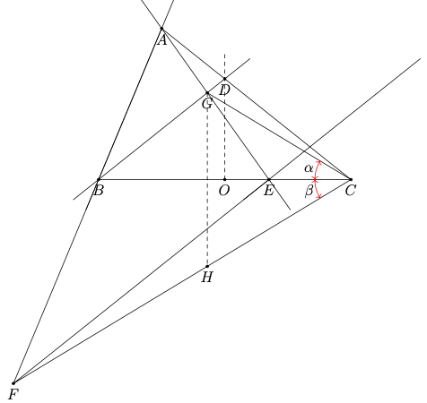

#  Exercice 1 - OPAM 2023 (Géométrie) 

## L'énoncé (fourni par [KouakouSchool](https://www.youtube.com/@kouakouschool))

!!! question "Énoncé du problème"

    Dans un triangle  $ABC$ tel que $AB < AC, D$ est un point du segment $[AC]$ tel que $BD=CD$. Une droite parallèle à $(BD)$ coupe le segment
    $[BC]$ en  $E$ et coupe la droite  $(AB)$ en  $F$.  $G$ est le point d'intersection des droites  $(AE)$ et  $(BD)$ par  $G$.

    $$ \textrm{Montrer que} \quad  \widehat{BCG} = \widehat{BCF}. $$

## Une solution (utilisation d'un repère orthonormal)

Ci-dessous se trouve la construction géométrique de la figure résultant du problème posé. Nous avons rajouté le milieu du segment $[BC]$ qu'on appellera $O$, le point $D'$ tel que la distance $OC$ égale à la distance $OD'$ et $D'$ appartient à $[OD)$ et le point $H$, le point de $(FC)$ tel que $(GH)$ est perpendiculaire à $(BC)$.

$$ \textrm{Montrons que} \quad \widehat{BCG} = \widehat{BCF} \quad \textrm{c'est-à-dire que} \quad \hat{\alpha} = \hat{\beta}. $$

Pour cela, nous allons considérer le repère orthonormal formé par les points $O$, $C$ et $D'$. Il s'agit bien d'un repère orthonormal car la droite $(OD)$ est perpendiculaire à la droite $(OC)$ puisque $(OD)$ est la médiatrice du segment $[BC]$ ($O$ est milieu de $[BC]$ et $BD = CD$) et la distance $OD'$ est égale à la distance $OC$.

Les coordonnées des différents points $A, B, C, D, E$ et $O$ sont les suivants.

!!! abstract "Coordonnées des points A, B, C, D, E et O"

    $$ O = \left(0, 0\right) $$

    $$ C = \left(1, 0\right) $$

    $$ D = \left(0, d\right), \quad \textrm{où} \quad d \quad \textrm{est une variable}. $$

    $$ B = \left(-1, 0\right) $$

    $$ A = \left(-\alpha, \beta\right), \quad \textrm{où} \quad 0 < \alpha < 1 \quad \textrm{et} \quad \beta > 1 \quad \textrm{sont des variables}. $$

    $$ E = \left(\gamma, 0\right), \quad \textrm{où} \quad -1 < \gamma < 1 \quad \textrm{où} \quad \gamma \quad \textrm{est une variable}. $$

La variable $\gamma$ est indépendante des autres variables d'après l'énoncé car le point $E$ est un point quelconque du segment $[BC]$.
La relation entre $\beta$, $\alpha$ et $d$ peut être déterminée d'après la position de $D$ par rapport aux points $A$, $B$ et $C$.

__Déterminons la relation entre $\beta$, $\alpha$ et $d$__:

La droite $(CD)$ a pour équation du type: $ax + by + c=0$. En remplaçant les coordonnées de $C$ et $D$ dans cette équation, l'on obtient:

$$ (DC): \quad x + \frac{1}{d}y - 1 = 0 $$

Le point $A$ appartient à la droite $(DC)$, donc: $-\alpha + \frac{1}{d}\beta - 1 = 0$. Cela implique que:

$$ \beta = d(1 + \alpha) $$

__Déterminons les valeurs des coordonnées de $F$ et $G$__:

Concernant le point $F$, $F\left(e, f\right)$ appartient à la droite $(AB)$ et $(FE)$ est perpendiculaire à la normale $\vec{u}$ à la droite $(BD)$.

$$ (BD): \quad x - \frac{1}{d}y + 1 = 0 $$

$$ \vec{u} \left(1, -\frac{1}{d}\right) $$

$$ (AB): \quad x - \frac{1 - \alpha}{d(1+\alpha)}y + 1 = 0 $$

donc:

$$ \overrightarrow{FE}.\vec{u} = 0 \quad et \quad F \in (AB) $$

$$ \left\{
    \begin{array}{l}
    e - \frac{1 - \alpha}{d(1 + \alpha)}f + 1 = 0 \\
    (\gamma - e).1 + \frac{1}{d}.f = 0
    \end{array}
\right.$$

ainsi:

$$ \left\{
    \begin{array}{l}
    e = \frac{\alpha\gamma - \gamma - \alpha - 1}{2\alpha} \\
    f = - \frac{d(\gamma + 1)(\alpha + 1)}{2\alpha}
    \end{array}
\right. $$

$$ F\left(\frac{\alpha\gamma - \gamma - \alpha - 1}{2\alpha}, - \frac{d(\gamma + 1)(\alpha + 1)}{2\alpha}\right) $$

Concernant le point $G$, on a:

$$ G\left(g, h\right) \in (BD) \cap (AE) $$

$$ (AE): \quad x + \frac{\alpha + \gamma}{d(1 + \alpha)}y - \gamma = 0 $$

L'équation de la droite $(BD)$ est donnée ci-dessus. Donc:

$$ \left\{
    \begin{array}{l}
    g - \frac{1}{d}h + 1 = 0 \\
    g + \frac{\alpha + \gamma}{d(1 + \alpha)}h - \gamma = 0
    \end{array}
\right.$$

ainsi:

$$ \left\{
    \begin{array}{l}
    g = \frac{\alpha(\gamma - 1)}{1 + 2\alpha + \gamma} \\
    h = \frac{d(1 + \gamma)(1+\alpha)}{1 + 2\alpha + \gamma}
    \end{array}
\right.$$

$$ G\left(\frac{\alpha(\gamma - 1)}{1 + 2\alpha + \gamma}, \frac{d(1 + \gamma)(1+\alpha)}{1 + 2\alpha + \gamma}\right) $$

Pour le point $H$, on a $H \in (FC)$ tel que $(GH) \perp (BC)$. L'abscisse de $H$ est égal à $g$ c'est-à-dire l'abscisse de $G$ car $(GH) \perp (BC)$ et $(BC)$ est l'axe des abscisses, on note donc  $H\left(g, i\right)$.

$$ (FC): \quad x + \frac{1 - e}{f}y - 1 = 0 $$

Donc:

$$ g + \frac{1 - e}{f}i - 1 = 0 $$

$1 - e \neq 0$, sinon $g = 1$. Il s'agit d'un cas limite impossible car $G \in [BC]$. De ce fait, nous pouvons écrire que:

$$ i = \frac{1 - g}{1 - e}f $$

D'où, d'après les coordonnées de $F$ et par la suite les coordonnées de $G$, on a:

$$ i = -\frac{d(\gamma + 1)(\alpha + 1)}{1 + 2\alpha + \gamma} = -h $$

Donc $G\left(g, h\right)$ et $H\left(g, -h\right)$, ainsi $CG = CH$ et $(HG) \perp (CB)$. D'où:

$$ \widehat{BCG} = \widehat{OCG} = \widehat{HCO} = \widehat{HCB} = \widehat{FCB} $$

Par conséquent, nous avons montré que:

$$ \widehat{BCG} = \widehat{BCF} \quad \textrm{c'est-à-dire que} \quad \hat{\alpha} = \hat{\beta} $$
